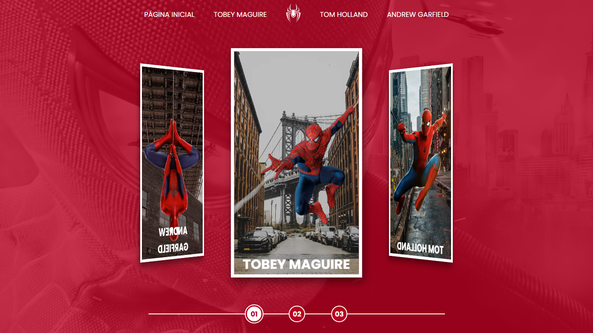
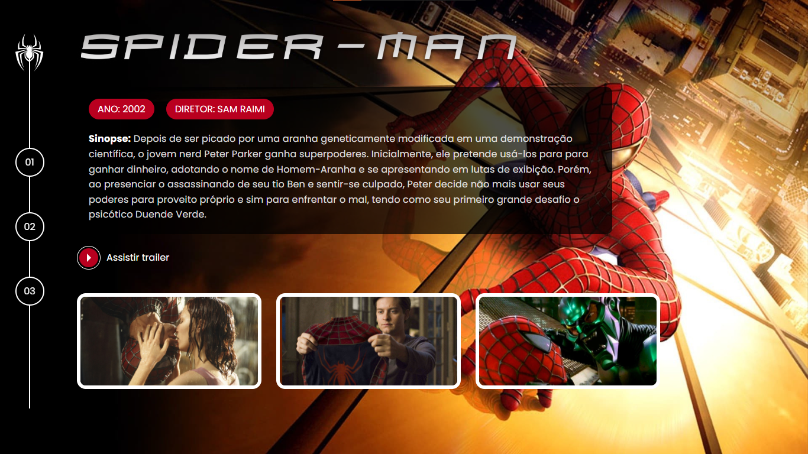
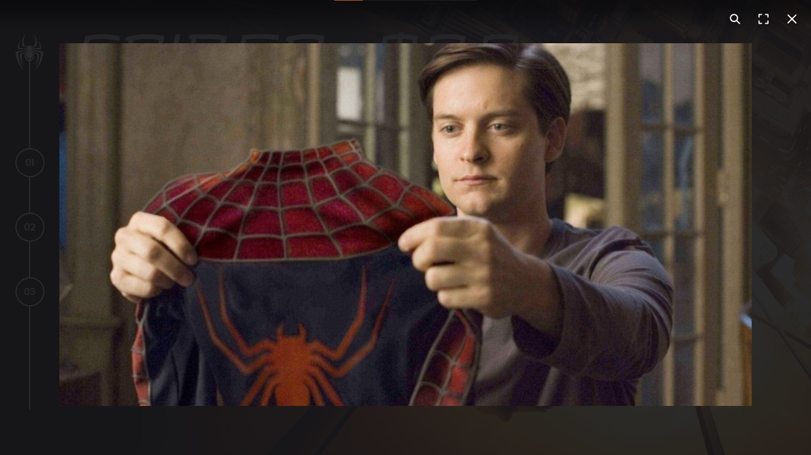

# 🕷️ Spider-Man Multiverse Project

Projeto desenvolvido com foco em **HTML, CSS e JavaScript**, explorando conceitos de layout, responsividade e organização de código.

---

## 🚀 Sobre o Projeto

Este projeto apresenta uma interface inspirada no universo do Homem-Aranha, com navegação entre diferentes versões do personagem.

---

## 🖼️ Preview

### 🔴 Preview 1 - Pagina Inicial

### 🔵 Preview 2 - Pagina do Filme

### ⚫ Preview 3 - Galeria

---

## 🛠️ Tecnologias Utilizadas

- HTML5  
- CSS3  
- JavaScript  

---

## 🎯 Objetivo

Praticar:
- Organização de arquivos
- Estilização com CSS
- Interatividade com JavaScript

---

## 📌 Status

✅ Projeto finalizado  
🚧 Possíveis melhorias futuras  

---

## 👨‍💻 Autor

Desenvolvido por Renato Macedo 😎
